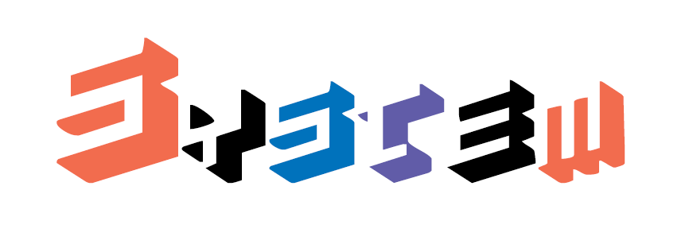

<<<<<<< HEAD


=======
```
    ____         __          
   / __/_ _____ / /____ __ _ 
  _\ \/ // (_-</ __/ -_)  ' \
 /___/\_, /___/\__/\__/_/_/_/
     /___/                   
```

# System
>>>>>>> ddc1364... Initial commit: System

[](https://circleci.com/gh/Jadovenn/System)

<<<<<<< HEAD
System is a playground kernel.
=======
This is an ambitious playground kernel. My goals are to learn more about operating-systems, kernel design and computer-architecture.
Feel free to participate to the development. 

Please read the [Get Started](https://github.com/domage-j/system/wiki/Get-Started) guide in the wiki.
>>>>>>> ddc1364... Initial commit: System

Please read the [Get Started](https://github.com/domage-j/system/wiki/Get-Started) guide in the wiki.
